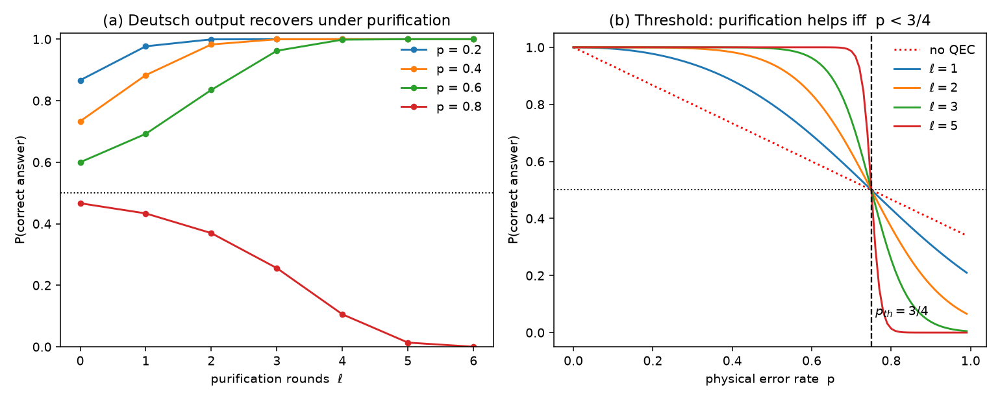
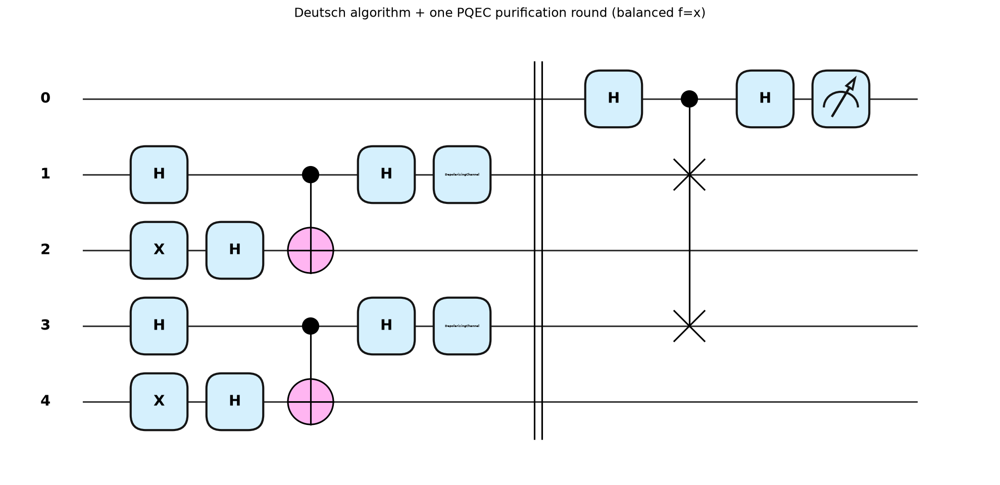
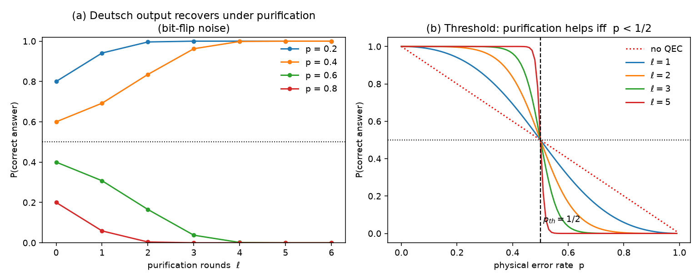
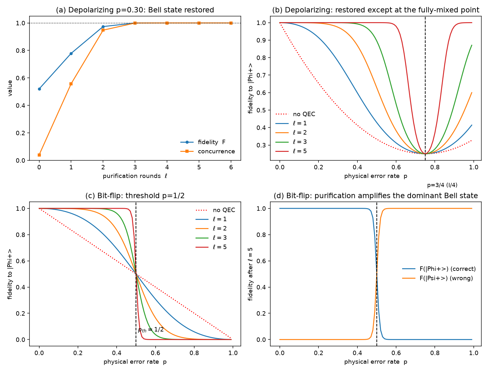
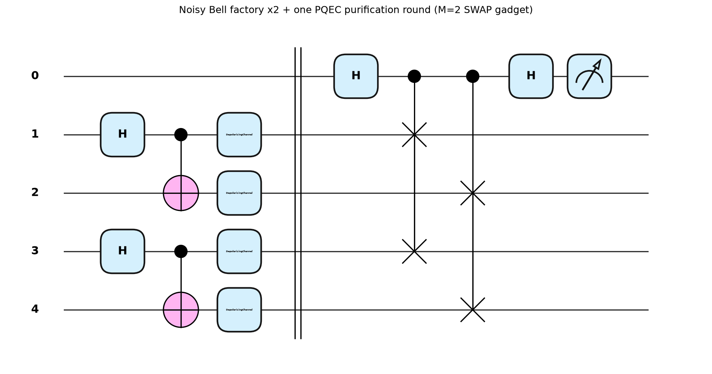
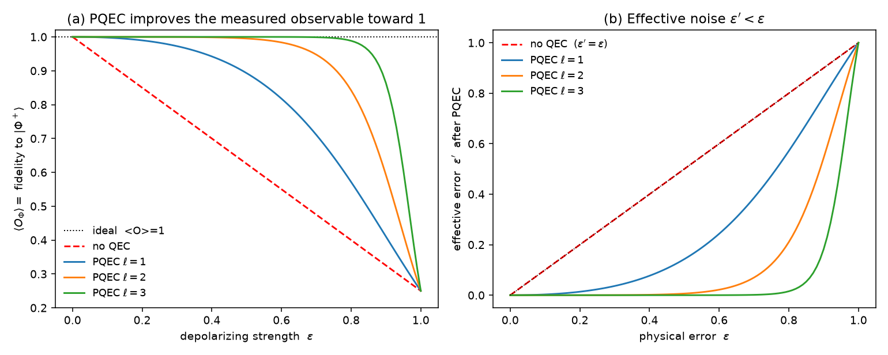

# Quantum Error Correction by Purification (PQEC) — PennyLane verification

PennyLane-based numerical verification of the purification-based quantum error
correction (**PQEC**) primitive from

> J. Raghoonanan & T. Byrnes, *Quantum Error Correction by Purification*,
> arXiv:2603.11568 (2026).

The core primitive is the **SWAP gadget**: a SWAP test applied to two identical
noisy copies `ρ ⊗ ρ` with an ancilla. Reading out the ancilla and post-processing
the outcomes with a parity sign extracts the *purified* component

```
P(ρ) = ρ² / Tr[ρ²] = Σ λ_i² |i⟩⟨i| / Σ λ_i²
```

which concentrates weight on the dominant eigenvector, raising the state's purity
and fidelity. Repeating over ℓ rounds consumes `N = 2^ℓ` copies and produces
`ρ^N / Tr[ρ^N]`, driving any non-maximally-mixed state toward a pure state.

This repo implements the gadget as a **genuine PennyLane circuit** on the
mixed-state simulator and checks every key equation of the paper to machine
precision, then reproduces the error-correction and threshold behaviour.

## Files

| File | Description |
|------|-------------|
| [`pqec.py`](pqec.py) | Core library: SWAP gadget as an explicit `default.mixed` circuit (H–CSWAP–H), purification map, noise channels, fidelity helpers |
| [`verify_pqec.py`](verify_pqec.py) | Verifies Eqs. (5)–(10), (7), (34); reproduces fidelity-vs-rounds and error thresholds; saves figures |
| [`draw_circuits.py`](draw_circuits.py) | Draws the full quantum circuits (Figs. 1 & 2) |
| [`deutsch_pqec.py`](deutsch_pqec.py) | **Applies PQEC to a real algorithm** — purifies the noisy output of the 2-qubit Deutsch algorithm and restores the answer (depolarizing, `p_th=3/4`) |
| [`deutsch_pqec_bitflip.py`](deutsch_pqec_bitflip.py) | Same demo under a **bit-flip** channel on the output qubit (`p_th=1/2`) |
| [`draw_deutsch_pqec.py`](draw_deutsch_pqec.py) | Draws the full Deutsch + one-round PQEC circuit |
| [`bell_pqec.py`](bell_pqec.py) | **Restores a Bell state** from many noisy copies — 2-qubit (M=2) PQEC recovers both fidelity and entanglement |
| [`draw_bell_pqec.py`](draw_bell_pqec.py) | Draws the full noisy-Bell ×2 + M=2 SWAP-gadget circuit |
| [`pqec_observable.py`](pqec_observable.py) | **The paper's actual protocol**: purified *observable* `⟨O⟩ = ⟨Ω⊗O⟩/⟨Ω⟩` measured from the ancilla-parity correlator; shows `⟨O⟩` improving toward ideal |

## Setup & run

```bash
python -m venv pqec_env
source pqec_env/bin/activate          # Windows: pqec_env\Scripts\activate
pip install -r requirements.txt

python verify_pqec.py     # numerical checks + result figures
python draw_circuits.py   # circuit diagrams
python deutsch_pqec.py         # PQEC on Deutsch, depolarizing noise (p_th=3/4)
python deutsch_pqec_bitflip.py # PQEC on Deutsch, bit-flip noise    (p_th=1/2)
python draw_deutsch_pqec.py    # full Deutsch + PQEC circuit diagram
python bell_pqec.py            # restore a Bell state from noisy copies
python draw_bell_pqec.py       # full noisy-Bell x2 + M=2 gadget circuit
python pqec_observable.py      # purified observable via ancilla-parity correlator
```

## Applying PQEC to an algorithm: the Deutsch algorithm

[`deutsch_pqec.py`](deutsch_pqec.py) plugs the purification gadget into a real
computation. The 2-qubit **Deutsch algorithm** decides whether a one-bit
function is *constant* or *balanced* in a single oracle query; ideally its
query qubit ends in a pure `|0⟩` (constant) or `|1⟩` (balanced), read with
certainty. A depolarizing channel on the output turns that qubit into a *mixed*
state and the answer becomes uncertain.

Because the correct answer is the **dominant eigenvector** of the noisy output,
feeding it back through the genuine SWAP-gadget circuit (`ρ → ρ²/Tr[ρ²]`)
concentrates weight back onto the right answer — no knowledge of which answer
is correct required. At `p=0.30` the success probability climbs
`0.80 → 0.94 → 0.996 → 1.000` over three purification rounds.

The same `p=3/4` depolarizing threshold reappears: **below it purification
drives P(correct) → 1, above it it amplifies the wrong answer → 0**, and all
round-count curves cross exactly at `p=3/4`.



**Full circuit** ([`draw_deutsch_pqec.py`](draw_deutsch_pqec.py)) — one
purification round needs two identical noisy copies, so the complete circuit is
two Deutsch runs (each `X·H·H·U_f·H·noise`) feeding a SWAP gadget
(`H–CSWAP–H–measure`) between the two query qubits:



### Different noise → different threshold

The output qubit carries the answer as a *computational-basis* state, so the
threshold depends on the noise channel. `deutsch_pqec.py` is parametrized by the
channel; [`deutsch_pqec_bitflip.py`](deutsch_pqec_bitflip.py) reuses it with a
**bit-flip** channel `ρ → (1−p)ρ + p·XρX`, which flips the answer bit `0↔1`. The
noisy state stays diagonal in the answer basis with the correct answer as the
dominant eigenvector while `p < 1/2`, so purification (a coherent majority vote)
recovers it — `P(correct) = 0.70 → 0.84 → 0.97 → 0.999 → 1.000` at `p=0.30`.

| Channel on output qubit | Recovery below threshold | Measured `p_th` | Theory |
|-------------------------|--------------------------|-----------------|--------|
| Depolarizing            | `0.80 → 1.000`           | **0.750**       | 3/4    |
| Bit-flip                | `0.70 → 1.000`           | **0.500**       | 1/2    |



## Restoring a Bell state from noisy copies

[`bell_pqec.py`](bell_pqec.py) generalizes PQEC from one qubit to a **2-qubit
register**: a Bell factory (`H`–`CNOT` → `|Φ⁺⟩`) emits noisy mixed copies, and
the SWAP gadget becomes a SWAP *test* between two 2-qubit registers (**M=2 =
two parallel Fredkin gates** + ancilla). Reading the ancilla still extracts
`ρ²/Tr[ρ²]` (dimension-independent), which concentrates weight on the dominant
eigenvector — `|Φ⁺⟩` while below threshold.

Under **local depolarizing p=0.30**, a single copy is barely entangled
(`F=0.52`, concurrence `0.04`); purification restores **both fidelity and
entanglement** to 1, consuming `N=2^ℓ` copies:

| rounds ℓ | copies N | fidelity | concurrence |
|:--------:|:--------:|:--------:|:-----------:|
| 0 | 1 | 0.520 | 0.040 |
| 1 | 2 | 0.779 | 0.558 |
| 2 | 4 | 0.974 | 0.948 |
| 3 | 8 | 1.000 | 0.999 |

Threshold structure depends on the channel (measured):

- **Local depolarizing (both qubits):** `|Φ⁺⟩` stays the dominant Bell component
  for every `p`, so it is restored everywhere **except the single fully-mixed
  point `p=3/4`** (`ρ=I/4`, a fixed point).
- **Bit-flip (one qubit):** clean threshold **`p=1/2`** — below it `|Φ⁺⟩` is
  restored, above it purification amplifies the *wrong* Bell state `|Ψ⁺⟩`.



**Full circuit** — two noisy Bell factories feeding the M=2 SWAP gadget:



## The paper's actual protocol: purified observables

The SWAP gadget does **not** deterministically output a purified state, and it is
**not** postselection. After the gadget the joint (ancilla, kept register) state is

```
P₊|0⟩⟨0|⊗ρ₊ + P₋|1⟩⟨1|⊗ρ₋ = ½( I⊗ρ + Z⊗ρ² ).
```

So for **any** observable `O`, measuring **Z on the ancilla together with O on the
register** gives, on average, `⟨Z⊗O⟩ = Tr(Oρ²)` and `⟨Z⊗I⟩ = Tr(ρ²)`, hence the
purified expectation value is a ratio of two physically measured correlators:

```
⟨O⟩_purified = ⟨Z⊗O⟩ / ⟨Z⊗I⟩ = Tr(Oρ²)/Tr(ρ²).
```

For `ℓ` rounds (binary tree, `N=2^ℓ` copies) the sign is the **total parity**
`Ω = Πᵢ Z_(anc,i)` of all ancillas: `⟨O⟩_ℓ = ⟨Ω⊗O⟩/⟨Ω⟩ = Tr(Oρ^N)/Tr(ρ^N)`. This is
a genuine measurement (Pauli-Z on ancillas correlated with `O`), **not** an algebraic
subtraction of density matrices. [`pqec_observable.py`](pqec_observable.py) measures it
on a real circuit (ℓ=1 on 5 wires, ℓ=2 tree on 11 wires) and matches the analytic value
to ~1e-16.

Scenario — a depolarized Bell state `ρ_ε=(1-ε)|Φ⁺⟩⟨Φ⁺|+ε I/D`, observable
`O=|Φ⁺⟩⟨Φ⁺|` (ideal `⟨O⟩=1`), at `ε=0.30`... shown here at `ε=0.40`:

| | `⟨O⟩` | effective `ε′` |
|--|:-----:|:--------------:|
| ideal | 1.000 | 0 |
| no QEC | 0.700 | 0.400 |
| PQEC ℓ=1 (N=2) | 0.942 | 0.077 |
| PQEC ℓ=2 (N=4) | 0.999 | 0.002 |
| PQEC ℓ=3 (N=8) | 1.000 | 0.000 |

PQEC returns the expectation value of a **much less noisy** effective Bell state
(`ε′ ≪ ε`), for the fidelity projector and for a generic Pauli observable (`⟨Z⊗Z⟩`)
alike.



## What is verified

The SWAP-test circuit reproduces the paper's equations to ~1e-16:

| Quantity | Paper Eq. | Max error (2000 random states) |
|----------|-----------|-------------------------------|
| `P± = (1 ± Tr ρ²)/2` | (5) | 5.6e-16 |
| `ρ± = (ρ ± ρ²)/2P±` | (6) | 5.6e-16 |
| `P₊ρ₊ + P₋ρ₋ = ρ` (average → input) | (8) | 5.6e-16 |
| `P₊ρ₊ − P₋ρ₋ = ρ²` (subtract → purified) | (9) | 5.6e-16 |
| circuit output `= ρ²/Tr ρ²` | (7) | 3.3e-16 |
| Bloch rescaling `r → 2r/(1+|r|²)` | (34) | 5.0e-16 |

Measured error thresholds (crossing point of ℓ=1 vs ℓ=3 curves):

| Channel | Measured | Paper |
|---------|----------|-------|
| Local depolarizing | **0.750** | 3/4 |
| Local dephasing | **0.500** | 1/2 |

## Circuits

**Elementary SWAP gadget** (Fig. 1b): `H` on ancilla, controlled-SWAP (Fredkin),
`H`, measure. For an M-qubit register the CSWAP becomes M parallel Fredkin gates.


**Depth-efficient binary tree**, ℓ=2, N=4 copies (Fig. 1a):


## Results

**Purification as a radial Bloch rescaling** — fixed points at |r|=0 (mixed) and
|r|=1 (pure); repeated rounds drive purity → 1:


**Fidelity vs cycles and error thresholds** — curves for different round counts ℓ
cross exactly at the thresholds p=3/4 (depolarizing) and p=1/2 (dephasing):

