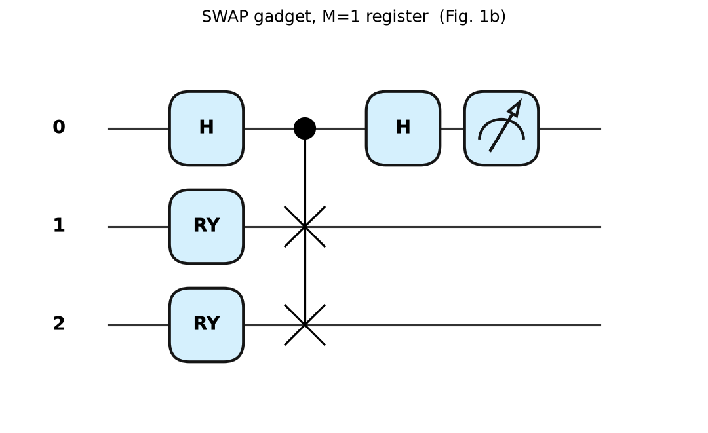
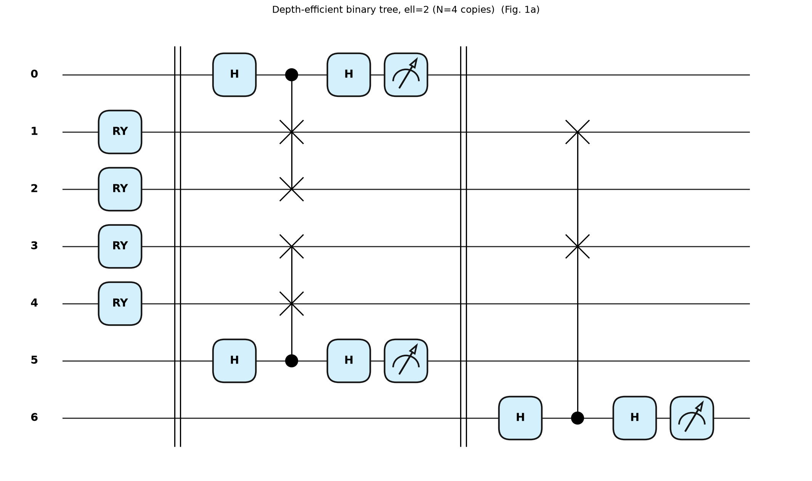
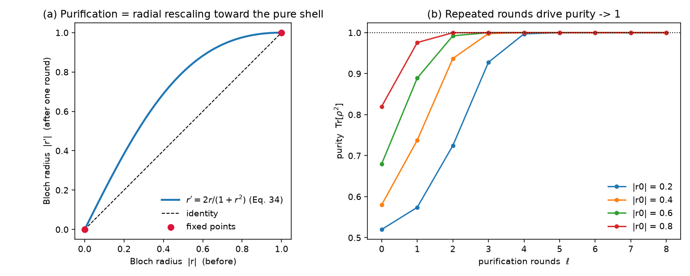
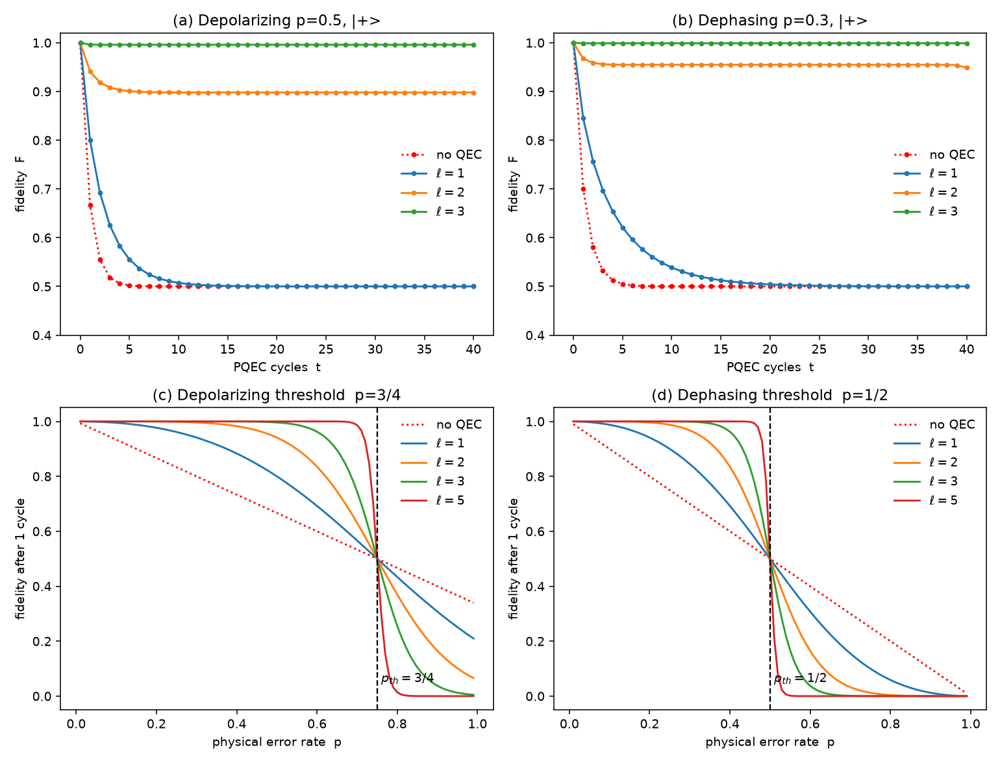
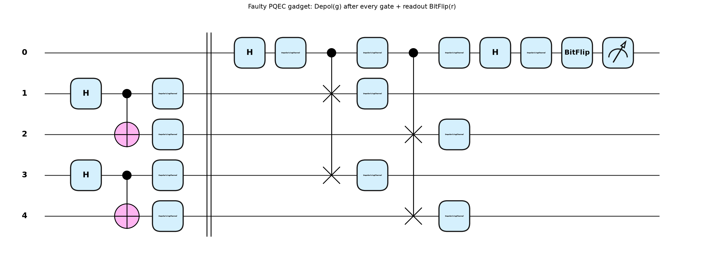
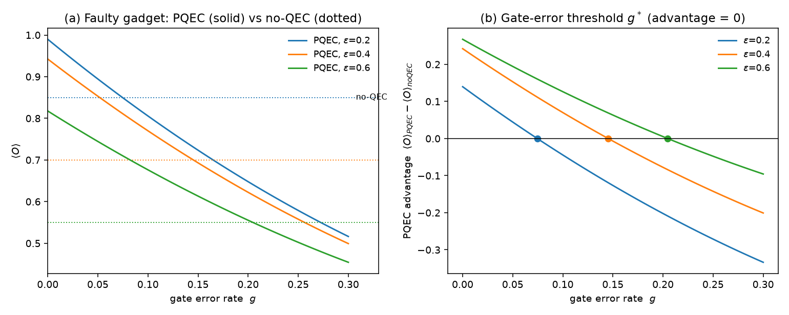

# Quantum Error Correction by Purification (PQEC) — PennyLane verification

PennyLane-based numerical verification of the purification-based quantum error
correction (**PQEC**) primitive from

> J. Raghoonanan & T. Byrnes, *Quantum Error Correction by Purification*,
> arXiv:2603.11568 (2026).

The core primitive is the **SWAP gadget**: a SWAP test applied to two identical
noisy copies `ρ ⊗ ρ` with an ancilla. Reading out the ancilla and post-processing
the outcomes with a parity sign extracts the *purified* component

```
P(ρ) = ρ² / Tr[ρ²] = Σ λ_i² |i⟩⟨i| / Σ λ_i²
```

which concentrates weight on the dominant eigenvector, raising the state's purity
and fidelity. Repeating over ℓ rounds consumes `N = 2^ℓ` copies and produces
`ρ^N / Tr[ρ^N]`, driving any non-maximally-mixed state toward a pure state.

This repo implements the gadget as a **genuine PennyLane circuit** on the
mixed-state simulator and checks every key equation of the paper to machine
precision, then reproduces the error-correction and threshold behaviour.

## Files

| File | Description |
|------|-------------|
| [`pqec.py`](pqec.py) | Core library: SWAP gadget as an explicit `default.mixed` circuit (H–CSWAP–H), purification map, noise channels, fidelity helpers |
| [`verify_pqec.py`](verify_pqec.py) | Verifies Eqs. (5)–(10), (7), (34); reproduces fidelity-vs-rounds and error thresholds; saves figures |
| [`draw_circuits.py`](draw_circuits.py) | Draws the full quantum circuits (Figs. 1 & 2) |

## Setup & run

```bash
python -m venv pqec_env
source pqec_env/bin/activate          # Windows: pqec_env\Scripts\activate
pip install -r requirements.txt

python verify_pqec.py     # numerical checks + result figures
python draw_circuits.py   # circuit diagrams
```

## What is verified

The SWAP-test circuit reproduces the paper's equations to ~1e-16:

| Quantity | Paper Eq. | Max error (2000 random states) |
|----------|-----------|-------------------------------|
| `P± = (1 ± Tr ρ²)/2` | (5) | 5.6e-16 |
| `ρ± = (ρ ± ρ²)/2P±` | (6) | 5.6e-16 |
| `P₊ρ₊ + P₋ρ₋ = ρ` (average → input) | (8) | 5.6e-16 |
| `P₊ρ₊ − P₋ρ₋ = ρ²` (subtract → purified) | (9) | 5.6e-16 |
| circuit output `= ρ²/Tr ρ²` | (7) | 3.3e-16 |
| Bloch rescaling `r → 2r/(1+|r|²)` | (34) | 5.0e-16 |

Measured error thresholds (crossing point of ℓ=1 vs ℓ=3 curves):

| Channel | Measured | Paper |
|---------|----------|-------|
| Local depolarizing | **0.750** | 3/4 |
| Local dephasing | **0.500** | 1/2 |

## Circuits

**Elementary SWAP gadget** (Fig. 1b): `H` on ancilla, controlled-SWAP (Fredkin),
`H`, measure. For an M-qubit register the CSWAP becomes M parallel Fredkin gates.



**Depth-efficient binary tree**, ℓ=2, N=4 copies (Fig. 1a):



## Results

**Purification as a radial Bloch rescaling** — fixed points at |r|=0 (mixed) and
|r|=1 (pure); repeated rounds drive purity → 1:



**Fidelity vs cycles and error thresholds** — curves for different round counts ℓ
cross exactly at the thresholds p=3/4 (depolarizing) and p=1/2 (dephasing):



## Example: faulty PQEC — noise on the gadget itself

Most PQEC studies put noise only on the **input** copies and assume the SWAP
gadget (H, controlled-SWAP/Fredkin, ancilla readout) is perfect. In reality
those gates are noisy too — especially the 3-qubit Fredkin — so the purifier can
inject as much error as it removes. This is the fault-tolerance question: **does
PQEC still help when the correction hardware is itself faulty?**

[`pqec_gate_noise.py`](pqec_gate_noise.py) simulates it by **inserting a noise
channel after every gadget gate**:

```python
qml.Hadamard(0);              _dep(0, g)          # depolarizing after H
qml.ctrl(qml.SWAP, 0)(wires=[1, 3])              # Fredkin (3-qubit gate)
for w in (0, 1, 3): _dep(w, g)                    #  → depol on each involved wire
qml.ctrl(qml.SWAP, 0)(wires=[2, 4])
for w in (0, 2, 4): _dep(w, g)
qml.Hadamard(0);              _dep(0, g)
qml.BitFlip(r, wires=0)                           # optional ancilla readout error
```

It then measures the purified observable `⟨O⟩ = ⟨Z⊗O⟩ / ⟨Z⊗I⟩` on a depolarized
Bell state (`O = |Φ⁺⟩⟨Φ⁺|`).

**Circuit** ([`draw_pqec_gate_noise.py`](draw_pqec_gate_noise.py)) — the full
gadget with a `Depol(g)` box after every gate and a readout `BitFlip(r)` before
the measurement. The input noise on the two Bell copies is the `Depol(ε)` boxes
right after each `H`–`CNOT` preparation (left of the barrier):



### Findings

**Gate-error threshold `g*`** — gate noise degrades `⟨O⟩_PQEC`; beyond `g*` the
purifier does *worse than no QEC* (it adds more error than it removes). At input
noise `ε=0.40`:

| gate noise `g` | `⟨O⟩_PQEC` | vs no-QEC (0.700) |
|:--------------:|:----------:|:-----------------:|
| 0.00 | 0.942 | +0.242 (helps) |
| 0.10 | 0.770 | +0.070 (helps) |
| 0.14 | 0.708 | +0.008 (helps) |
| 0.16 | 0.678 | −0.022 (**hurts**) |
| 0.30 | 0.499 | −0.201 (**hurts**) |

→ `g* ≈ 0.145`.

**`g*` grows with input noise `ε`** (`ε=0.2 → g*≈0.075`, `0.4 → 0.145`,
`0.6 → 0.205`): a nearly-clean input has little to gain and is easily spoiled by
a faulty purifier, while a very noisy input tolerates a sloppier gadget.

**Readout error self-mitigates** — a symmetric ancilla readout flip scales both
`⟨Z⊗O⟩` and `⟨Z⊗I⟩` by `1−2r`, which cancels in the ratio, so `⟨O⟩_PQEC` is
independent of `r`.

```bash
python pqec_gate_noise.py       # gate-error threshold + readout cancellation, saves figure
python draw_pqec_gate_noise.py  # draws the faulty-gadget circuit
```


